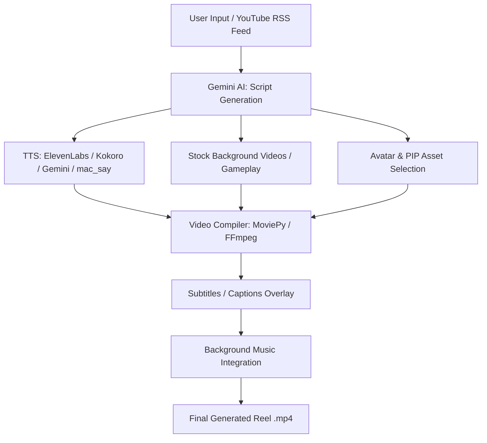

# Faceless Reel Generator (Thrice AI)

An advanced, fully automated tool to generate high-quality vertical video reels. By leveraging AI for scriptwriting, multi-engine text-to-speech, and automated video compilation (complete with subtitles, avatars, and PIP features), this project turns simple topics or YouTube RSS feeds into engaging content. You can interact with it via a local Next.js Web App dashboard or entirely through a secure Telegram Bot.

## Key Features

- **AI Script Generation**: Automatically drafts contextual dialogue using Gemini AI.
- **Multiple TTS Engines Supported**:
  - **ElevenLabs**: High-quality, premium cloud voice cloning.
  - **Gemini TTS**: Integrated cloud TTS from Google.
  - **Kokoro**: Local, fast, ONNX-based open-source TTS.
  - **macOS Native (`say`)**: Built-in, zero-dependency offline TTS for Mac users.
- **Rich Video Compilation (MoviePy / FFmpeg)**:
  - Dynamic overlay of animated subtitles with customizable fonts and stroke colors.
  - Automated integration of Avatar images (bouncing animation when speaking).
  - Picture-in-Picture (PIP) asset overlay support.
  - Random stock video background selection and background music integration.
- **Telegram Bot Interface**: Control the entire pipeline securely from your phone.
- **Content Ingestion**: Capable of digesting YouTube RSS feeds for trending topics.

## Project Architecture & Workflow



## Prerequisites

- **Python**: Version 3.12 or higher.
- **Package Manager**: [uv](https://github.com/astral-sh/uv) (Recommended) or `pip`.
- **System Tools**:
  - `FFmpeg`: Essential for video processing.
  - `ImageMagick`: Required by MoviePy for text/subtitle generations.

## Installation

### macOS

1. **Install System Dependencies** (using Homebrew):
   ```bash
   brew install ffmpeg imagemagick
   ```
   *Note: Ensure the `MAGICK_HOME` environment variable is set or `convert`/`magick` is in your PATH.*

2. **Install `uv` (Recommended)**:
   ```bash
   curl -LsSf https://astral.sh/uv/install.sh | sh
   ```

### Linux / Windows
Install Python, FFmpeg, and ImageMagick via your OS package manager (`apt`, `dnf`, `choco`, etc.).

### Project Setup

1. **Clone the Repository**:
   ```bash
   git clone <repository_url>
   cd thriceai
   ```

2. **Install Python Dependencies**:
   ```bash
   uv sync
   # OR: pip install -e .
   ```

3. **Setup Frontend (Optional for Dashboard)**:
   ```bash
   cd web_app
   bun install
   ```

4. **Prepare Local Assets (Required Directories)**:
   Ensure you place your local models and media in the `data/` directory:
   - `data/assets/bg_videos/`: Drop your background MP4s here.
   - `data/assets/avatars/`: PNG avatars for characters.
   - `data/models/kokoro/`: (If using Kokoro) Place `kokoro-v1.0.onnx` and `voices-v1.0.bin` here.
   - `data/fonts/`: Place your `Inter_28pt-ExtraBold.ttf` or preferred fonts.

## Configuration (.env)

Create a `.env` file in the root directory. Configure only what you need:

```ini
# --- LLM API Keys ---
GEMINI_API_KEY=your_gemini_api_key_here
CLAUDE=your_claude_api_key_here

# --- TTS Providers ---
ELEVEN_API=your_elevenlabs_api_key_here

# --- Telegram Bot Configuration ---
TELEGRAM_BOT=your_telegram_bot_token_here
TELEGRAM_CHAT_ID=@your_channel_or_chat_id
# CRITICAL: Comma-separated Telegram User IDs allowed to use bot commands
AUTHORIZED_TELEGRAM_USERS=123456789,987654321
```

## Usage

### 1. Telegram Bot (Recommended)
The bot provides a secure, remote interface for the generation pipeline:
1. Start the backend: `uv run run.py`
2. Message your bot on Telegram:
   - `/help`: List all commands.
   - `/script <topic> <filename>`: Generate a script.
   - `/generate <filename> [audio_mode]`: Generate a reel from a script. Supported audio modes: `kokoro_mlx`, `kokoro`, `mac_say`, `elevenlabs`, `gemini`.
   - `/reel <topic>`: **Full Auto Mode** (Script -> Reel -> Caption -> Telegram Upload).
   - `/status`: Check generation progress.

### 2. Local Web Dashboard
For local visual management:
1. Start the Backend: `uv run run.py` (Hosts API on Port 8008)
2. Start the Frontend:
   ```bash
   cd web_app
   bun run dev
   ```
3. Open `http://localhost:3031` (or local IP) in your browser.

## Screenshots

### Main Dashboard & Generation Workflow

*Initial view showing feed and batch generation modes.*

### Script Generation

*Input interface for script generation.*


*The system generating a script based on user input.*

### Video Generation & Monitoring

*Batch generation of reels.*


*Real-time updates during the generation process.*


*Monitoring individual video generation tasks.*

### Components & Insights

*Adding visual components like characters and PIP.*


*Post-generation insights and analytics.*

## Troubleshooting & Notes
- **ImageMagick Policy Error**: If ImageMagick blocks `@` symbols (needed for text files), edit `/etc/ImageMagick-6/policy.xml` (location varies) to allow reading `.txt` files.
- **Missing Fonts**: Ensure the font paths in `backend/config.py` correctly point to existing `.ttf` files in your `data/fonts/` directory.
