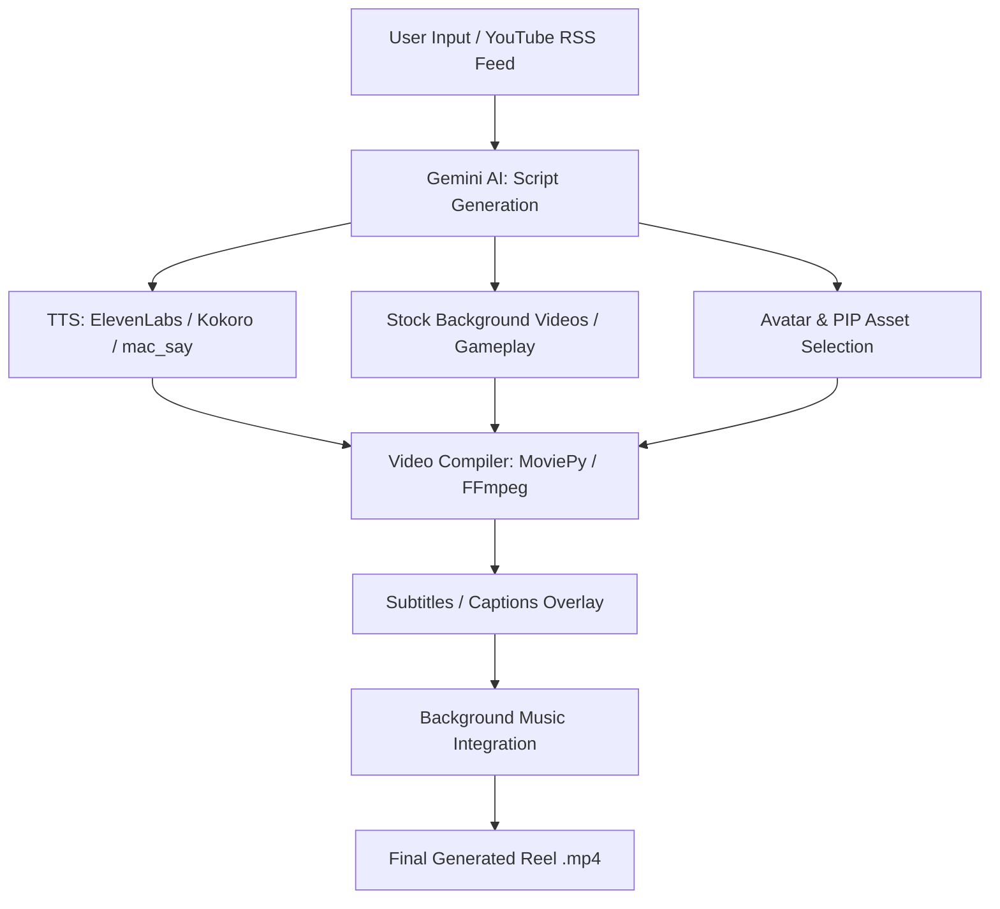

# Faceless Reel Generator

An automated tool to generate video reels using AI-generated content, complete with voiceovers, subtitles, and background videos.

## Project Workflow



## Prerequisites

- **Python**: Version 3.12 or higher.
- **Package Manager**: [uv](https://github.com/astral-sh/uv) (Recommended for faster dependency management) or `pip`.
- **System Tools**:
  - `FFmpeg`: Required for video processing.
  - `ImageMagick`: Required for generating text captions on videos.

## Installation

### macOS

1.  **Install System Dependencies** (using [Homebrew](https://brew.sh/)):

    ```bash
    brew install ffmpeg imagemagick
    ```

    _Note: If you run into issues with ImageMagick and moviepy, ensure the `MAGICK_HOME` environment variable is set or that `convert` / `magick` is in your PATH._

2.  **Install `uv` (Optional but Recommended)**:
    ```bash
    curl -LsSf https://astral.sh/uv/install.sh | sh
    ```

### Linux (Fedora)

1.  **Install System Dependencies**:
    You may need to enable RPM Fusion repositories for FFmpeg if not already enabled.

    ```bash
    sudo dnf install ffmpeg ImageMagick
    ```

    To ensure you have necessary headers for building Python packages (like Pillow or others if wheels are unavailable):

    ```bash
    sudo dnf groupinstall "Development Tools"
    sudo dnf install python3-devel libjpeg-devel zlib-devel
    ```

    _Note: Depending on your Fedora version, `ImageMagick` might be named `ImageMagick-devel` if you need development headers, but the binary is usually sufficient for MoviePy._

2.  **Install `uv` (Optional but Recommended)**:
    ```bash
    curl -LsSf https://astral.sh/uv/install.sh | sh
    ```

## Setup

1.  **Clone the Repository**:

    ```bash
    git clone <repository_url>
    cd faceless_project
    ```

2.  **Environment Configuration**:
    Create a `.env` file in the root directory. You can use the example below or copy from a provided template if available.

    **Required Variables**:

    ```ini
    ELEVEN_API=your_elevenlabs_api_key
    GEMINI_API_KEY=your_gemini_api_key
    ```

    _Add other keys as found in `backend/config.py` if necessary._

3.  **Install Python Dependencies**:
    Using `uv`:

    ```bash
    uv sync
    ```

    Or using `pip`:

    ```bash
    pip install -e .
    ```

4.  **Setup Frontend**:
    ```bash
    cd web_app
    bun install
    ```

## Usage

To start the backend:

```bash
uv run run.py
```

To start the frontend:

```bash
cd web_app
bun run dev
```

The application will start, and you see the output indicating the local URL (usually `http://0.0.0.0:8008` or similar).

## Screenshots

### Main Dashboard & Generation Workflow

*Initial view showing feed and batch generation modes.*

### Script Generation

*Input interface for script generation.*


*The system generating a script based on user input.*

### Video Generation & Monitoring

*Batch generation of reels.*


*Real-time updates during the generation process.*


*Monitoring individual video generation tasks.*

### Components & Insights

*Adding visual components like characters and PIP.*


*Post-generation insights and analytics.*

## Notes

- **Policy**: The `ImageMagick` security policy might block the use of the `@` symbol (needed for reading text files). If you encounter errors, you may need to edit `/etc/ImageMagick-6/policy.xml` (location varies) to allow reading text files.
- **Font**: Ensure the font specified in `backend/config.py` exists, or the script may fail or fallback to a default font.
